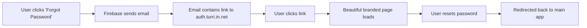

<div align="center">

# 🔐 Firebase Authentication Action Handler

### **Beautiful, Branded Authentication Experience for Turri Platform**

[](https://app.netlify.com/sites/your-site/deploys)
[](https://firebase.google.com/)
[](https://reactjs.org/)
[](https://www.typescriptlang.org/)
[](https://tailwindcss.com/)

---

**🌐 Live Site:** [auth.turri.in.net](https://auth.turri.in.net)  
**🏠 Main App:** [turri.in.net](https://turri.in.net)

</div>

---

## 🎯 **What is This?**

This is a **custom authentication action handler** that provides a branded, professional experience for Firebase authentication actions. Instead of users seeing Firebase's generic pages, they get a beautiful, consistent experience on your domain.

<div align="center">

### **✨ Before vs After**

| 🚫 **Firebase Default** | ✅ **Your Branded Experience** |
|:---:|:---:|
| Generic Firebase domain | `auth.turri.in.net` |
| Basic styling | Beautiful dark/light mode |
| No branding | Consistent with your app |
| Poor mobile experience | Fully responsive |

</div>

---

## 🚀 **Features**

<table>
<tr>
<td width="50%">

### 🎨 **Design & UX**
- ✅ **Dark/Light Mode** - Auto-detects system preference
- ✅ **Fully Responsive** - Perfect on all devices
- ✅ **Smooth Animations** - Polished micro-interactions
- ✅ **Clean Typography** - Professional, readable fonts
- ✅ **Consistent Branding** - Matches your app's identity

</td>
<td width="50%">

### 🔐 **Authentication Actions**
- ✅ **Password Reset** - Secure password updates
- ✅ **Email Verification** - Confirm new accounts
- ✅ **Email Change** - Verify new email addresses
- ✅ **Email Recovery** - Restore compromised accounts
- ✅ **Error Handling** - Clear, helpful error messages

</td>
</tr>
</table>

---

## 🛠️ **How It Works**

<div align="center">



</div>

### **🔄 User Journey**

1. **🔑 User Action** - Clicks "Forgot Password" in your main app
2. **📧 Email Sent** - Firebase sends email with custom action URL
3. **🌐 Branded Experience** - User lands on `auth.turri.in.net/auth-action`
4. **✨ Beautiful Interface** - Clean, professional password reset form
5. **🔒 Secure Processing** - Firebase handles all security validation
6. **↩️ Return Home** - User redirected back to your main app

---

## ⚙️ **Firebase Console Setup**

### **📋 Quick Setup Checklist**

- [ ] Open [Firebase Console](https://console.firebase.google.com/)
- [ ] Navigate to **Authentication** → **Templates**
- [ ] Update Action URL for each template
- [ ] Test with a real email

### **🎯 Action URL Configuration**

Set this URL in Firebase Console for **ALL** email templates:

```bash
https://auth.turri.in.net/auth-action
```

<details>
<summary><strong>📖 Detailed Setup Instructions</strong></summary>

1. **Go to Firebase Console**
   ```
   https://console.firebase.google.com/
   ```

2. **Select Your Project**
   - Choose your Turri project

3. **Navigate to Authentication**
   ```
   Authentication → Templates
   ```

4. **Update Each Template**
   - **Password Reset** → Edit → Set Action URL
   - **Email Verification** → Edit → Set Action URL  
   - **Email Change** → Edit → Set Action URL
   - **Email Recovery** → Edit → Set Action URL

5. **Save Changes**
   - Click "Save" for each template

</details>

---

## 🔧 **Supported Authentication Actions**

<table>
<tr>
<th width="25%">Action Type</th>
<th width="25%">Firebase Mode</th>
<th width="25%">When Used</th>
<th width="25%">User Experience</th>
</tr>
<tr>
<td><strong>Password Reset</strong></td>
<td><code>resetPassword</code></td>
<td>User forgot password</td>
<td>Secure password update form</td>
</tr>
<tr>
<td><strong>Email Verification</strong></td>
<td><code>verifyEmail</code></td>
<td>New account signup</td>
<td>One-click email confirmation</td>
</tr>
<tr>
<td><strong>Email Change</strong></td>
<td><code>verifyAndChangeEmail</code></td>
<td>User changes email</td>
<td>Verify new email address</td>
</tr>
<tr>
<td><strong>Email Recovery</strong></td>
<td><code>recoverEmail</code></td>
<td>Account compromise</td>
<td>Restore original email</td>
</tr>
</table>

---

## 🌐 **URL Structure & Parameters**

### **📝 Example URLs**

```bash
# Password Reset
https://auth.turri.in.net/auth-action?mode=resetPassword&oobCode=ABC123&continueUrl=https://turri.in.net

# Email Verification  
https://auth.turri.in.net/auth-action?mode=verifyEmail&oobCode=XYZ789&continueUrl=https://turri.in.net

# Email Change
https://auth.turri.in.net/auth-action?mode=verifyAndChangeEmail&oobCode=DEF456&continueUrl=https://turri.in.net
```

### **🔍 Parameter Reference**

| Parameter | Required | Description | Example |
|:---|:---:|:---|:---|
| `mode` | ✅ | Authentication action type | `resetPassword` |
| `oobCode` | ✅ | One-time action code from Firebase | `ABC123...` |
| `continueUrl` | ❌ | Redirect URL after completion | `https://turri.in.net` |
| `lang` | ❌ | Language code for localization | `en` |

---

## 💻 **Development**

### **🚀 Quick Start**

```bash
# Clone the repository
git clone https://github.com/your-username/firebase-auth-handler.git

# Navigate to project
cd firebase-auth-handler

# Install dependencies
npm install

# Start development server
npm run dev

# Build for production
npm run build
```

### **📁 Project Structure**

```
src/
├── components/
│   ├── AuthAction.tsx      # Main auth action handler
│   ├── AuthHandler.tsx     # URL parameter parser
│   ├── DarkModeToggle.tsx  # Theme switcher
│   └── NotFound.tsx        # 404 page with custom GIF
├── firebase/
│   └── config.ts           # Firebase configuration
├── hooks/
│   └── useDarkMode.ts      # Dark mode logic
├── App.tsx                 # Main application
└── main.tsx               # Entry point
```

### **🔧 Environment Setup**

Update `src/firebase/config.ts` with your Firebase credentials:

```typescript
const firebaseConfig = {
  apiKey: "your-api-key",
  authDomain: "your-auth-domain",
  projectId: "your-project-id",
  storageBucket: "your-storage-bucket",
  messagingSenderId: "your-messaging-sender-id",
  appId: "your-app-id"
};
```

---

## 🚀 **Deployment**

### **📦 Netlify Deployment**

This project is optimized for Netlify with automatic SPA routing:

```bash
# Build the project
npm run build

# Deploy to Netlify
# The netlify.toml file handles all configuration
```

### **🔧 Configuration Files**

- **`netlify.toml`** - Build settings and redirects
- **`public/_redirects`** - SPA routing for auth-action URLs
- **`package.json`** - Build scripts and dependencies

---

## 🔒 **Security Features**

<div align="center">

| 🛡️ **Security Layer** | ✅ **Implementation** |
|:---|:---|
| **HTTPS Required** | All production URLs use HTTPS |
| **Firebase Validation** | All action codes validated before processing |
| **No Data Exposure** | Sensitive data never exposed in errors |
| **Secure Redirects** | Only trusted domains for redirects |
| **Input Validation** | All form inputs properly validated |

</div>

---

## 🎨 **Design System**

### **🌓 Theme Colors**

<table>
<tr>
<td width="50%">

#### **🌞 Light Mode**
- **Background:** Pure White (`#FFFFFF`)
- **Cards:** White with Gray Borders
- **Text:** Black Headings, Gray Body
- **Buttons:** Black with White Text
- **Icons:** Black Backgrounds

</td>
<td width="50%">

#### **🌙 Dark Mode**
- **Background:** Pure Black (`#000000`)
- **Cards:** Dark Gray with Gray Borders  
- **Text:** White Headings, Light Gray Body
- **Buttons:** White with Black Text
- **Icons:** White Backgrounds

</td>
</tr>
</table>

### **📱 Responsive Breakpoints**

```css
/* Mobile First Approach */
sm: 640px   /* Small devices */
md: 768px   /* Medium devices */
lg: 1024px  /* Large devices */
xl: 1280px  /* Extra large devices */
```

---

## 🤝 **Contributing**

We welcome contributions! Here's how you can help:

### **🐛 Bug Reports**
- Use the issue template
- Include screenshots
- Provide reproduction steps

### **✨ Feature Requests**
- Describe the use case
- Explain the expected behavior
- Consider backward compatibility

### **🔧 Pull Requests**
- Fork the repository
- Create a feature branch
- Write clear commit messages
- Include tests if applicable

---

## 📞 **Support & Contact**

<div align="center">

### **Need Help?**

| 📧 **Email** | 🌐 **Website** | 💬 **Discord** |
|:---:|:---:|:---:|
| [support@turri.in.net](mailto:support@turri.in.net) | [turri.in.net](https://turri.in.net) | [Join Server](https://discord.gg/turri) |

</div>

---

## 📄 **License**

```
MIT License

Copyright (c) 2024 Turri Platform

Permission is hereby granted, free of charge, to any person obtaining a copy
of this software and associated documentation files (the "Software"), to deal
in the Software without restriction, including without limitation the rights
to use, copy, modify, merge, publish, distribute, sublicense, and/or sell
copies of the Software, and to permit persons to whom the Software is
furnished to do so, subject to the following conditions:

The above copyright notice and this permission notice shall be included in all
copies or substantial portions of the Software.

THE SOFTWARE IS PROVIDED "AS IS", WITHOUT WARRANTY OF ANY KIND, EXPRESS OR
IMPLIED, INCLUDING BUT NOT LIMITED TO THE WARRANTIES OF MERCHANTABILITY,
FITNESS FOR A PARTICULAR PURPOSE AND NONINFRINGEMENT. IN NO EVENT SHALL THE
AUTHORS OR COPYRIGHT HOLDERS BE LIABLE FOR ANY CLAIM, DAMAGES OR OTHER
LIABILITY, WHETHER IN AN ACTION OF CONTRACT, TORT OR OTHERWISE, ARISING FROM,
OUT OF OR IN CONNECTION WITH THE SOFTWARE OR THE USE OR OTHER DEALINGS IN THE
SOFTWARE.
```

---

<div align="center">

### **⭐ Star this repository if it helped you!**

**Made with ❤️ for the Turri Platform**

[🔝 Back to Top](#-firebase-authentication-action-handler)

</div>